# 📊 Insertion Sort - Atividade Comparativa

Atividade prática para implementação e comparação de desempenho do algoritmo **Insertion Sort**, incluindo:
- 🧩 Versão simples
- ⚙️ Versão otimizada com interrupção antecipada para vetores ordenados

---

## 📁 Estrutura de Arquivos

- `insertion_sort_simples.py` — Versão simples do algoritmo
- `insertion_sort_otimizado.py` — Versão otimizada para interrupção antecipada
- `main.py` — Script para comparar o desempenho das duas versões
- `prints/` — Pasta contendo os prints das execuções

---

## 🎯 Objetivo

- Implementar o Insertion Sort simples.
- Implementar uma versão otimizada que identifica se o vetor está ordenado e interrompe a execução.
- Exibir o vetor a cada iteração durante o processo de ordenação.
- Comparar as duas versões com diferentes tipos de vetores para analisar desempenho.

---

## 🧪 Testes Realizados

Foram utilizados três tipos de vetores para análise:
- 🔀 Vetor Aleatório
- ✅ Vetor Ordenado
- 🔄 Vetor Invertido

---

## 🖥️ Prints das Execuções

### 🧩 insertion_sort_simples.py

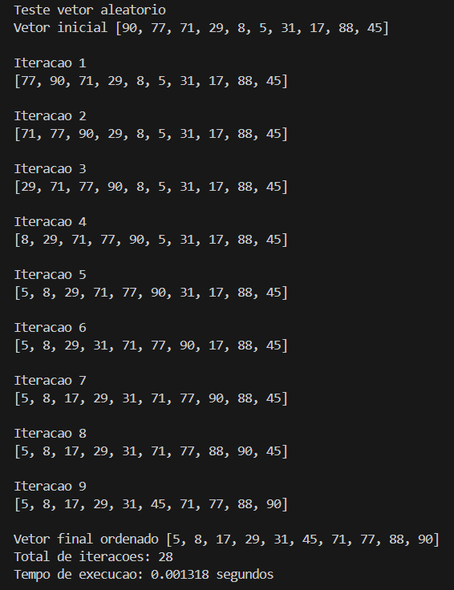
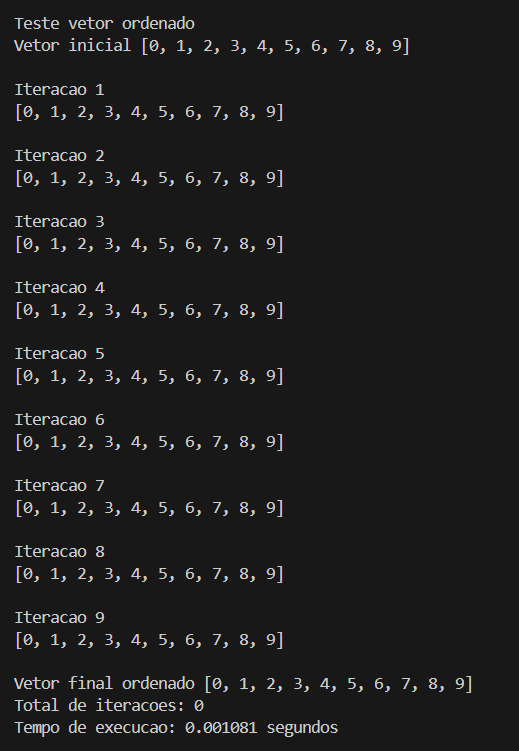
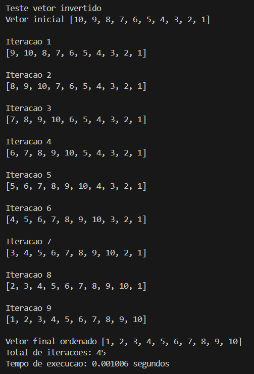

---

### ⚙️ insertion_sort_otimizado.py

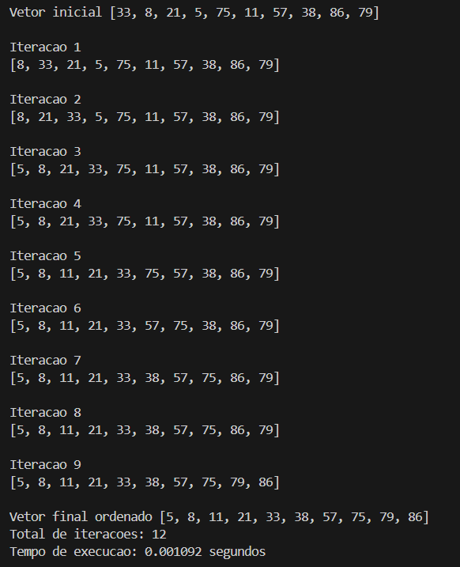
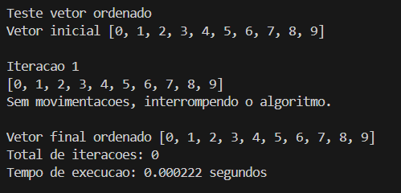
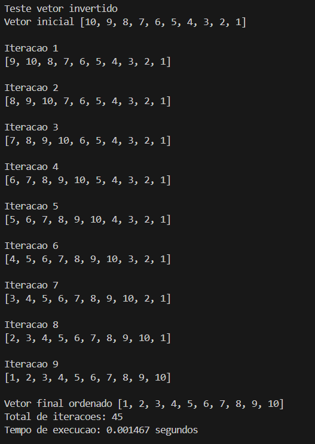

---

### 📊 main.py (Comparação)

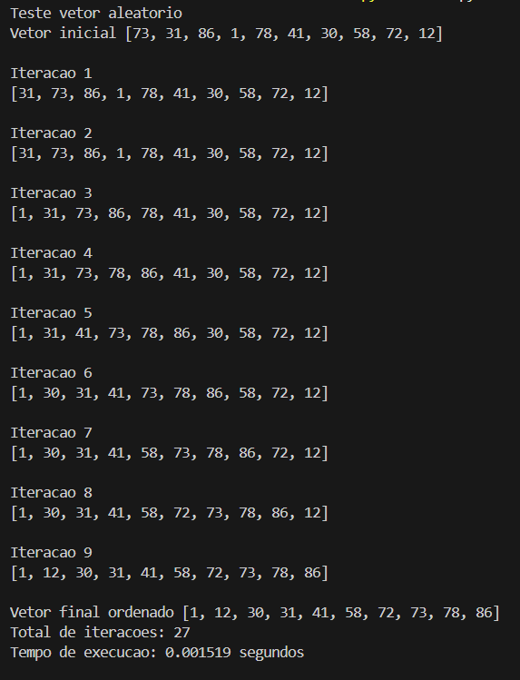
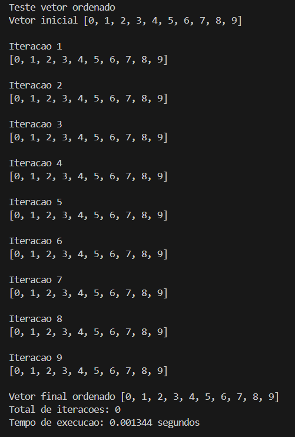
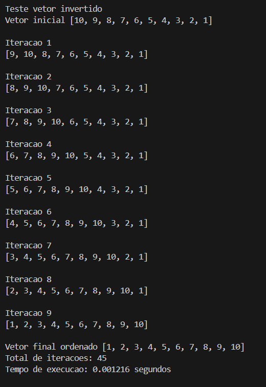
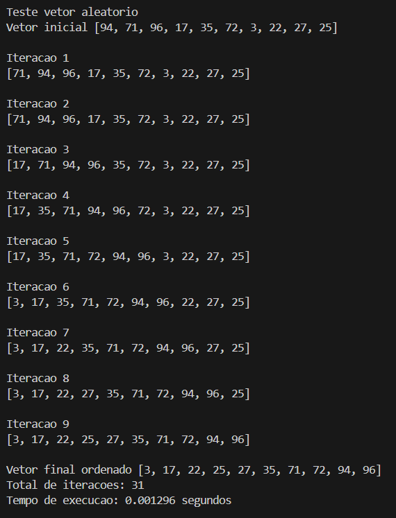
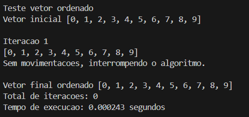

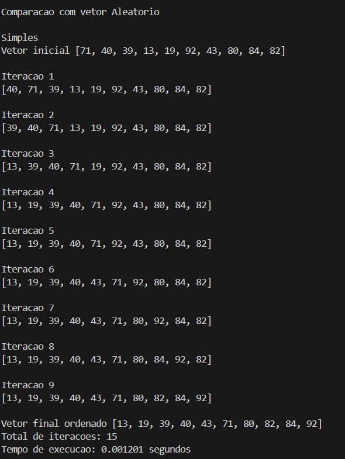
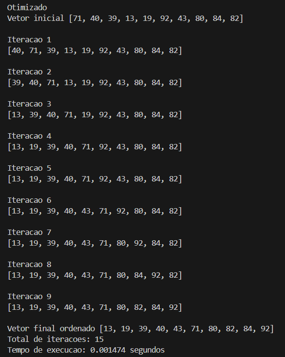
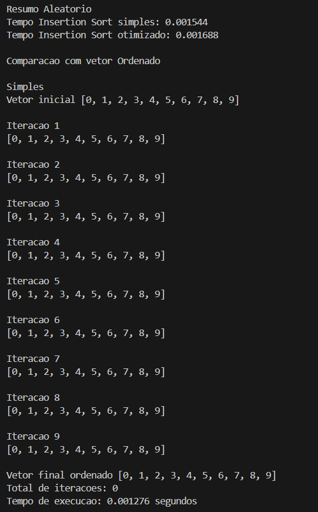
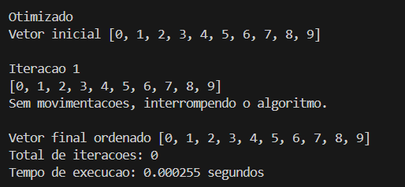
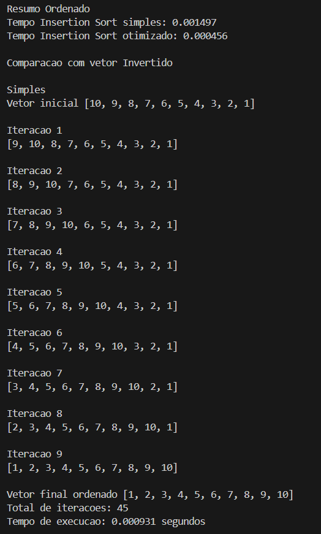
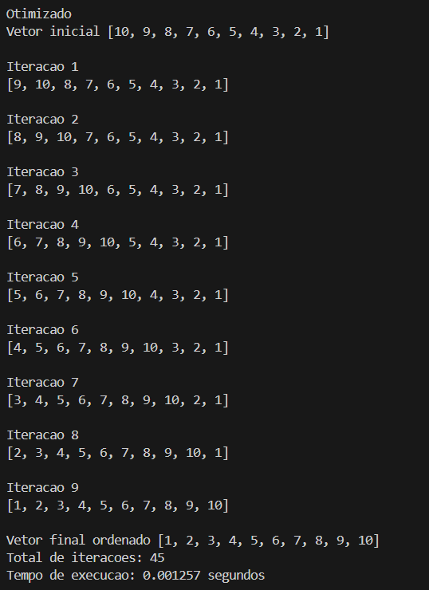
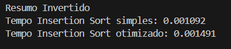

---

## ✅ Conclusão

A versão otimizada do Insertion Sort demonstrou eficiência superior no caso de vetores ordenados, reduzindo o tempo de execução ao interromper o processo prematuramente.  
Para vetores aleatórios e invertidos, o desempenho entre as versões foi equivalente, como esperado.

---

## ✍️ Autor

Desenvolvido por Gabriel Henrique Moreira de Souza.
